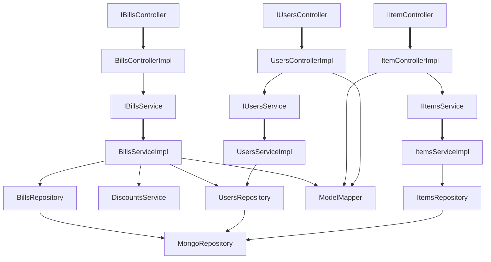

# Retail store

This is a service that provides: 
1. Persistence and calculation of users, items and bills.
2. Calculation of bill discount

Prequisites:

 - [Java 11](https://www.oracle.com/java/technologies/downloads/#java11)
 - [Maven 3.6.x+](https://archive.apache.org/dist/maven/maven-3/3.6.3/binaries/)
 - [Docker](https://www.docker.com/get-started/)
 - [Docker compose](https://docs.docker.com/compose/)

To build the application use:
```
mvn clean package
```


This will build a jar file in target directory:
**target/retailstore-0.0.1-SNAPSHOT.jar** 

To run the jar use:
```
java -jar target/retailstore-0.0.1-SNAPSHOT.jar
```

To build a docker image use:
```
 docker build --tag=retailstore:latest .
```
To start the docker image use:
```
docker run -p8080:8080 retailstore:latest
```
To stop the image from running use:
```
docker stop retailstore:latest
```
To start the application using docker-compose use:
```
docker-compose up
```

To run unit-tests use:
```
mvn test
```
To run integration tests use:
```
mvn verify -Psurefire
```

To find the test coverage open the file in: 
_target/site/jacoco/index.html_ 
with a browser of your choice navigate to check test coverage.

Class diagrams:




